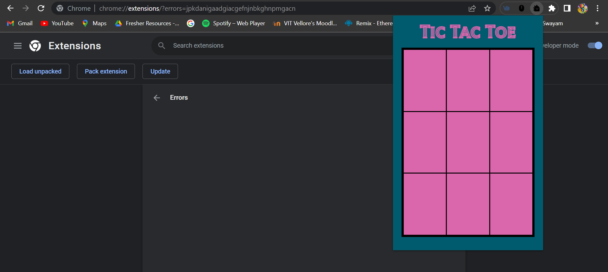
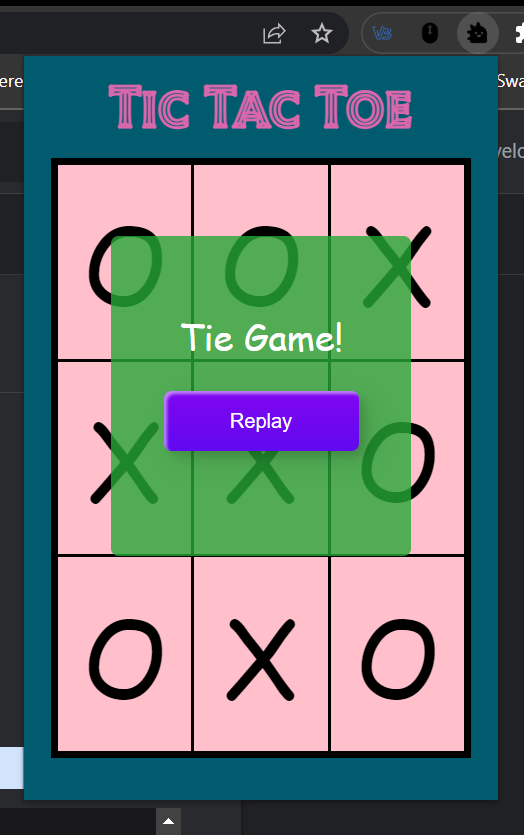

# Tic Tac Toe Chrome Extension

The Tic Tac Toe Chrome Extension is a single-player game that allows users to play the classic game of Tic Tac Toe within Google Chrome. The extension provides an interactive interface where users can make their moves and play against a preprogrammed opponent.

## Features

- User-friendly interface for an enjoyable gaming experience.
- Single-player mode against a preprogrammed opponent.
- Responsive design that works across different screen sizes.
- Real-time feedback and updates on game status.
- Simple installation process as a Google Chrome extension.

## Installation

1. Clone or download the repository to your local machine.
2. Open Google Chrome and go to `chrome://extensions`.
3. Enable the **Developer mode** by toggling the switch on the top-right corner of the page.
4. Click on the **Load unpacked** button.
5. Select the folder containing the cloned/downloaded repository.
6. The Tic Tac Toe Chrome Extension will be added to your Chrome browser.

## Usage

1. Click on the Tic Tac Toe Chrome Extension icon in the browser toolbar.
2. The game board will be displayed, and you can start playing by clicking on the cells.
3. The preprogrammed opponent will make its moves automatically.
4. The game will continue until there is a winner or a draw.

## Technologies Used

- HTML
- CSS
- JavaScript

## Credits

- The Tic Tac Toe Chrome Extension was developed by [Jeevaa S V].

## License

This project is licensed under the [MIT License](LICENSE).
